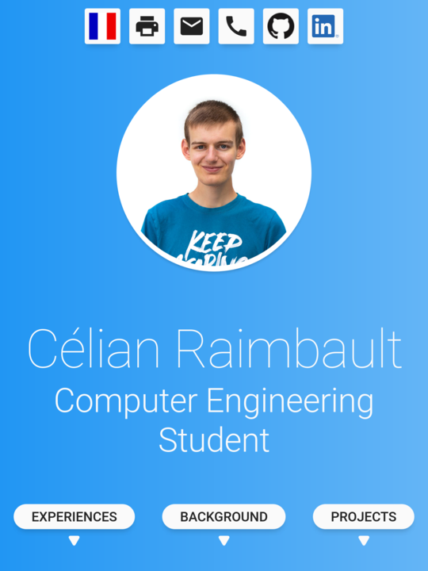

# Célian Raimbault
My [online resume / portfolio](https://cc618.github.io/Celian).

## Screenshots




## Details
Made with HTML, SASS and ReactJS.

## Build
Here is a list of commands to test / build / deploy this website.

### Testing (debug mode with hot reload)
```sh
npm start
```

### Build (release mode)
```sh
npm run build
```

### Github Pages deployment (release mode)
```sh
npm run deploy
```

## License
A [CUSTOM license](LICENSE) is used for this project.
Roughly, do not copy or redistribute any part of this project, this project is used only for EDUCATIONAL PURPOSES.
